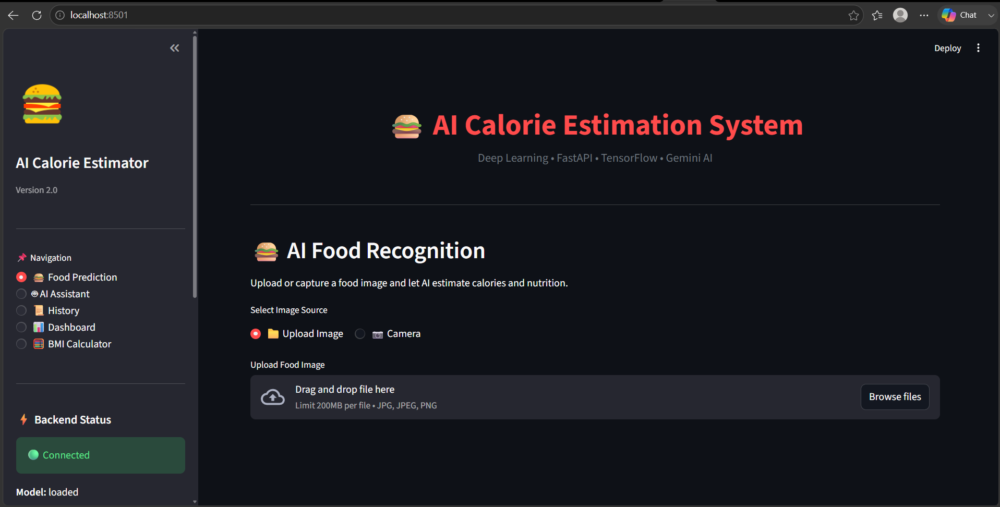
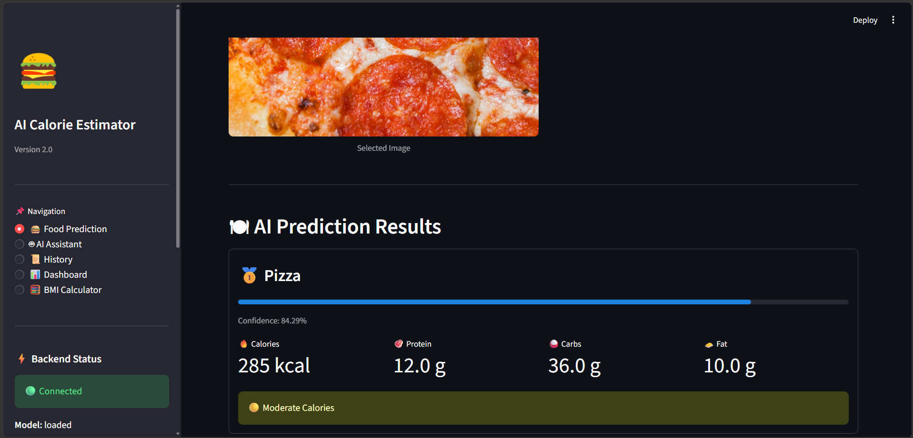
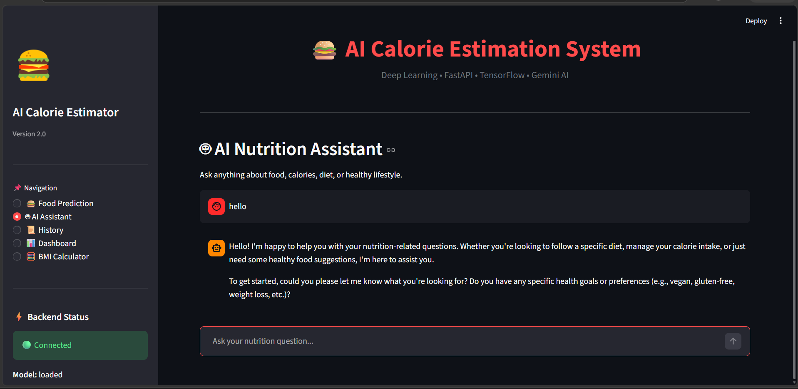
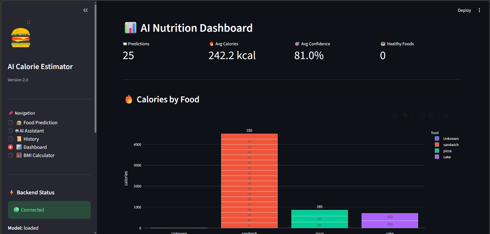
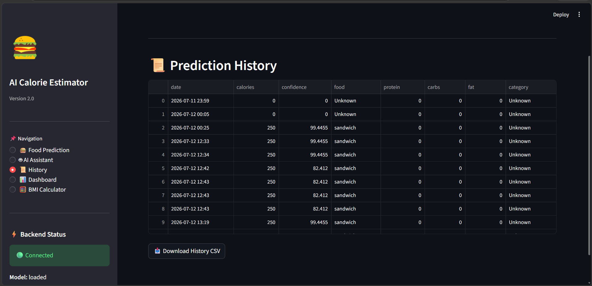

# 🍔 AI Calorie Estimation System

<p align="center">

An AI-powered food recognition and calorie estimation system built using **Deep Learning**, **FastAPI**, **Streamlit**, and **Google Gemini AI**.

It predicts food from an image, estimates nutritional values, stores prediction history, provides interactive dashboards, and includes an AI Nutrition Assistant for personalized food-related queries.

</p>

---

# 🚀 Features

- 🍕 Food Image Recognition using CNN
- 🔥 Calorie Estimation
- 🥗 Nutrition Information
- 📊 Interactive Dashboard
- 🤖 Gemini AI Nutrition Assistant
- 📜 Prediction History
- 📥 Download Prediction History (CSV)
- ⚡ FastAPI Backend
- 🎨 Modern Streamlit UI

---

# 🛠 Tech Stack

| Category | Technologies |
|-----------|--------------|
| Frontend | Streamlit |
| Backend | FastAPI |
| AI Model | TensorFlow / Keras CNN |
| Computer Vision | OpenCV |
| Data Processing | Pandas, NumPy |
| Visualization | Plotly |
| AI Assistant | Google Gemini API |
| Language | Python |

---

# 📂 Project Structure

```text
AI-Calorie-Estimator/
│
├── api/
├── assets/
├── dataset/
├── llm/
├── model/
├── nutrition/
├── reports/
├── webapp/
├── history.json
├── requirements.txt
├── README.md
└── .gitignore
```

---

# 🏠 Home Page



---

# 🍔 Food Prediction

Upload or capture a food image and let the AI identify the food and estimate calories.



---

# 🤖 AI Nutrition Assistant

Ask nutrition-related questions powered by Google Gemini AI.

Examples:

- Healthy breakfast ideas
- Weight loss diet
- Muscle gain foods
- Nutrition tips



---

# 📊 Dashboard

Interactive dashboard displaying:

- Total Predictions
- Average Calories
- Highest & Lowest Calorie Foods
- Food Distribution
- Confidence Trend
- Calories by Food



---

# 📜 Prediction History

Stores every prediction locally and allows exporting as CSV.



---

# ⚙ Installation

Clone the repository

```bash
git clone https://github.com/Bhavyasree2013/AI-Calorie-Estimator.git
```

Go into the project

```bash
cd AI-Calorie-Estimator
```

Create virtual environment

```bash
python -m venv .venv
```

Activate

### Windows

```bash
.venv\Scripts\activate
```

### Linux / macOS

```bash
source .venv/bin/activate
```

Install dependencies

```bash
pip install -r requirements.txt
```

---

# ▶ Run Backend

```bash
uvicorn api.server:app --reload
```

Runs at

```
http://127.0.0.1:8000
```

---

# ▶ Run Streamlit

```bash
streamlit run webapp/app.py
```

Runs at

```
http://localhost:8501
```

---

# 📈 Future Improvements

- Barcode Scanner
- Meal Planning
- BMI Calculator
- Daily Calorie Tracker
- User Authentication
- Cloud Deployment
- Mobile Application
- Multi-language Support

---

# 👨‍💻 Author

**Bhavya Sree Pindi**

B.Tech – Artificial Intelligence & Data Science

GitHub:
https://github.com/Bhavyasree2013

---

# ⭐ If you like this project

Please consider giving this repository a ⭐ on GitHub.

It motivates me to build more AI-powered applications.

---

## 📜 License

This project is licensed under the MIT License.
